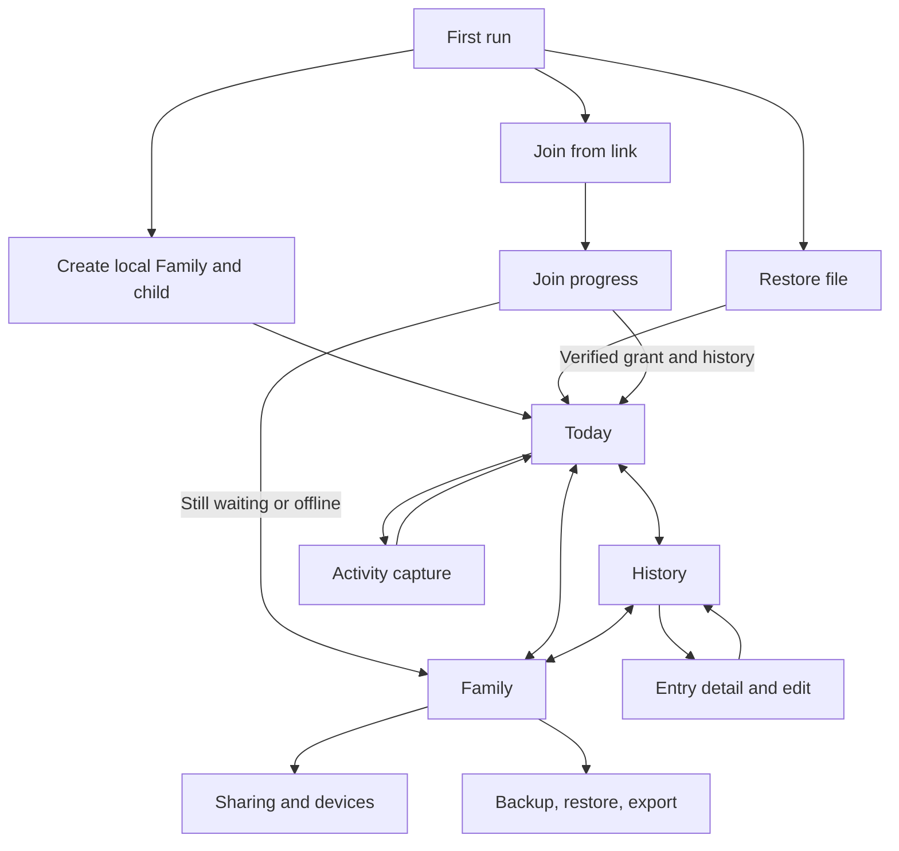

# Android navigation and screen structure

Status: proposed for M1 implementation. This topic owns the Android screen
map and navigation behavior. [005](../tactical/005-m1-android.md) owns the
delivery steps and test evidence. The [event model](event-model.md) and
[Family sharing contract](family-sharing-and-trust.md) own data and access
semantics; this layout does not change them.

## Reference and current problem

Twenty locally saved, gitignored Android reference screenshots supplied on
2026-09-28 show a home activity grid, dedicated timer and capture screens,
separate list and week reports, a child profile, and settings. The useful
patterns are a visible selected child, fast common actions, persistent
primary navigation, and a focused Save action. The reference app also puts
settings and export deep in the child profile, devotes primary tabs to paid
advice, and shows promotional blocks beside daily actions. Those patterns
do not fit this MVP's accountless tracking and Family access model. The
screenshots include private details and remain only in `local-references/`;
this document deliberately records no names or values from them.

The current Android app presents Today, all activity forms, History, Family
access, join, and backup in one scrolling Compose screen. Scroll shortcuts
help, but changing between daily logging, old entries, and sharing still
requires searching a long page. The navigation change should reuse the
existing Rust-backed actions and projection.

## Primary destinations

Use three persistent bottom destinations after a Family is usable:

| Destination | First screen | Main actions |
| --- | --- | --- |
| Today | Selected Family and child, running timer, compact daily summary, common actions, recent entries | Start/stop sleep, quick diaper, add feed, open all activity types |
| History | Selected child's day-grouped timeline | Choose day, filter type, inspect/correct/delete an entry |
| Family | Current Family status and children, with sections for access, data, and preferences | Switch Family or child, add child, invite/manage devices, sync status/retry, backup/restore/export |

The selected Family and child remain explicit on Today, History, and the
capture screen. A child switcher is reachable from the top bar without
visiting Family; Family is the home for managing children. A pending,
keyless join is listed as an enrollment task under Family, never as a
usable Family in the target switcher. Keep the bottom bar visible on main
destinations; capture and edit screens may take the full viewport to keep
the form and Save action clear. Android Back returns to the caller with its
day/filter/scroll state preserved.

## Screen behavior

1. **First run.** Show Create Family, Join Family, and Restore file. No
   account or relay is needed to create and log locally. A link opens Join
   with its link filled in and an explicit Start or retry action. A saved
   pending attempt shows its verified stage and can resume in the
   background; it does not force the caregiver to reopen the screen.
2. **Today.** Put the current target and running sleep state above the fold.
   Keep quick actions limited to the highest-frequency events, with an
   obvious Add activity action for the rest. Show recent entries from the
   same projection as History. A running timer remains visible here and in
   the existing notification/widget; the screen does not maintain a second
   timer or alter its saved target.
3. **Capture.** Open a dedicated form or sheet for each supported activity.
   Show Family, child, activity type, and event time before Save. Preserve a
   draft after a failed save, clear it after success, and return to the
   caller. Switching target closes or explicitly discards a target-bound
   draft, as the current app does. Existing correction and deletion actions
   stay on the same record through Rust.
4. **History.** Start with the existing day-grouped, filtered list. Entry
   detail handles edit/delete and the existing short Undo. A simple date
   selector is enough for M1; week grids, charts, and averages can follow
   only if daily use shows a need. Preserve unknown-event placeholders.
5. **Family.** Put device access and join progress beside backup, restore,
   analysis export, and child management. Show current local/shared status
   in plain language. Keep any developer relay configuration visibly
   separate from caregiver actions until the sharing UI is ready.

## States that must remain visible

| State | Navigation consequence |
| --- | --- |
| No Family or no child | First-run or add-child task; no activity Save without a target |
| Local or verified shared Family | Appears in switcher and permits normal tracking |
| Claim/proof/grant/history pending | Join progress task with the verified stage; absent from usable target switcher |
| Offline or uncertain upload | Original Family and durable work stay selected; show pending/retry, not delivered or removed |
| Verified removal with pending work | Name the durable private-copy destination and require an explicit Open action before dismissing its notice |
| Verified removal without pending work | Offer an explicit private copy; do not create one just for visiting the screen |

Every navigation action carries the exact Family and child IDs already
chosen by the user. A stale timer, widget, deep link, or edit must be checked
against current core state before it writes. The Family destination never
promises a remote access change before the relay confirms it.

## Delivery and validation direction

Move the existing Compose UI in small slices: (1) navigation shell and
target header, (2) Today with focused capture routes, (3) History with the
existing edit paths, (4) Family, enrollment, and file recovery. Keep the
current core and relay APIs as the source of data. Validate the common
create/log/history/restart path at normal and 1.5× text size, then the
link-to-pending-to-ready path, Family/child switches with a draft or timer,
and verified removal/private-copy notice. Add short UI checks where the new
route could hide a recovery or access state; the existing real-relay suite
continues to verify the underlying transitions.

Defer paid content, AI logging, clinical sleep advice, promotional banners,
and reference-only activity types outside the [MVP event model](event-model.md).
Do not copy the reference app's layout, words, icons, or assets.

## Reconsider when

Daily use on phones shows that the three destinations hide a frequent action,
caregivers cannot identify the target before Save, or the Family screen makes
join/recovery status hard to find. Evaluate that evidence before adding tabs
or a customizable home grid.
