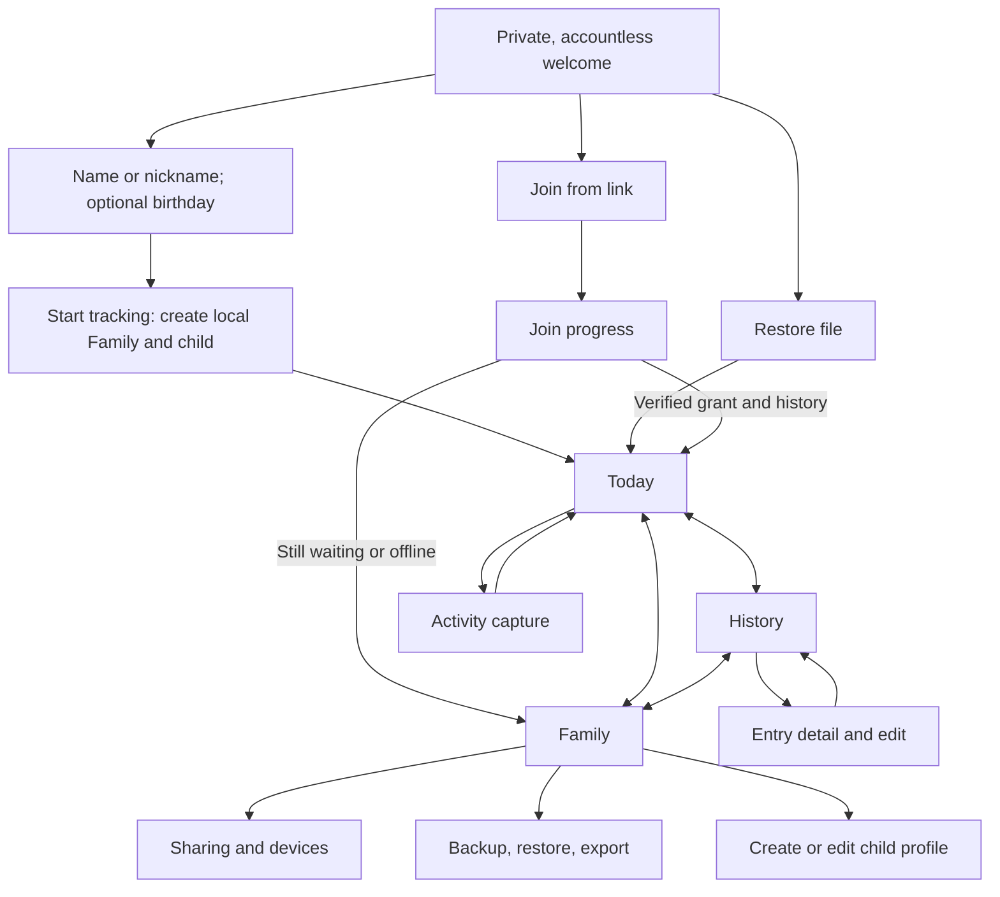

# Android navigation and screen structure

Status: M1 route shell and the [010](../tactical/010-android-design-pass.md)
presentation pass implemented; phone validation continues. This topic owns
the Android screen
map and navigation behavior. [005](../tactical/005-m1-android.md) owns the
delivery steps and test evidence. The [event model](event-model.md) and
[Family sharing contract](family-sharing-and-trust.md) own data and access
semantics; this layout does not change them.
The [interface design and localization topic](interface-design-and-localization.md)
owns the visual system and translation-ready UI rules for these routes.

## Reference and current problem

Twenty locally saved, gitignored Android reference screenshots supplied on
2026-09-28 show a home activity grid, dedicated timer and capture screens,
separate list and week reports, a child profile, and settings. The useful
patterns are a visible selected child, fast common actions, persistent
primary navigation, and a focused Save action. The reference app also puts
settings and export deep in the child profile, devotes primary tabs to paid
advice, and shows promotional blocks beside daily actions. Those patterns
do not fit this MVP's accountless tracking and Family access model. The
screenshots include private details and remain only in `local-references/`;
this document deliberately records no names or values from them.
An additional child-profile reference supplied on 2026-09-29 is held there
too. Its useful pattern is one focused create/edit form with a reachable
Save action.

The former Android screen put Today, activity forms, History, Family access,
join, and backup in one scroll. The current debug app has Today, History, and
Family destinations, focused capture forms, and an explicit target header.
It reuses the existing Rust-backed actions and projection. The header opens
a target picker, History has an optional day filter, and Family keeps data
and backup controls in an expandable section. Visual density and route
return behavior still need phone use and accessibility review.

## Primary destinations

Use three persistent bottom destinations after a Family is usable:

| Destination | First screen | Main actions |
| --- | --- | --- |
| Today | Selected Family and child, running timer, compact daily summary, common actions, recent entries | Start/stop sleep, quick diaper, add feed, open all activity types |
| History | Selected child's day-grouped timeline | Choose day, filter type, inspect/correct/delete an entry |
| Family | Current Family status and children, with sections for access, data, and preferences | Switch Family or child, add child, invite/manage devices, sync status/retry, backup/restore/export |

The selected Family and child remain explicit on Today, History, and the
capture screen. A child switcher is reachable from the top bar without
visiting Family; Family is the home for managing children. A pending,
keyless join is listed as an enrollment task under Family, never as a
usable Family in the target switcher. Keep the bottom bar visible on main
destinations; capture and edit screens may take the full viewport to keep
the form and Save action clear. Android Back returns to the caller with its
day/filter/scroll state preserved.

## Screen behavior

1. **First run.** Show a private, accountless welcome with **Add your child**
   as the primary action, plus **Join a Family** and **Restore backup**.
   One child form requires only a name or nickname; birth date is optional
   without additional form instructions. Growth-chart sex stays in the regular
   profile editor. **Start tracking** creates the local Family and child through the
   Rust core, then opens Today. No account, relay, permission prompt, or
   tracking-preference checklist is needed. A quiet privacy explanation
   describes device storage, optional sharing, and backup access without
   claiming that shared or exported records have no readers.
   The private app preferences retain the UI draft across reopening. Back
   before saving creates no Family; failed or interrupted setup reuses its
   staged local Family, preserving input and avoiding duplicate creation.
   The draft is not canonical child storage. A link opens Join directly
   with its link filled in and an explicit Start or retry action. A saved
   pending enrollment and a restore preview take precedence over the welcome.
   Cancelling the initial file picker returns to the welcome. A pending
   attempt can resume in the background without reopening its screen.
2. **Today.** Put the current child and running sleep state above the fold.
   Feed, Sleep, and Diaper tiles show each group's last event from the same
   projection as History and open its capture form; the Sleep tile starts or
   stops the timer directly. Keep further quick actions limited to the
   highest-frequency events, with an obvious Add activity action for the
   rest. A running sleep remains visible here and in the existing
   notification/widget; the screen's elapsed clock reads the saved start and
   does not maintain a second timer or alter its saved target.
3. **Capture.** Open a dedicated form for each supported activity.
   Show child, activity type, and event time before Save; the Family is named
   in the top bar only when more than one Family is available. Preserve a
   draft after a failed save, clear it after success, and return to the
   caller. Switching target closes or explicitly discards a target-bound
   draft, as the current app does. Existing correction and deletion actions
   stay on the same record through Rust. A live nursing timer is an unsaved,
   target-scoped UI draft kept in private app preferences across process
   death, like the web timer in the [event model](event-model.md#timers);
   Save writes one segment list through the existing Rust action and clears
   the draft only after the write succeeds. Android rounds each timed side to
   whole minutes (at least one) so the saved entry remains correctable with
   the minute-based correction form; pauses are kept as gaps.
   Running nursing and pumping drafts also appear in quiet notifications;
   paused nursing keeps a static duration until Save or discard. Each
   notification has its own Family/child/type identity, and its tap carries
   the draft's session start. Cold and warm taps wait for the exact current
   core Family/child projection and matching persisted draft before opening
   capture; stale or unavailable targets show a no-longer-available message
   without opening another child's form or changing data.
4. **History.** Default to a Day view: a week strip and date picker select
   the day, the core's day summary for that day appears above its entries
   (which include any entry that overlaps the day, such as an overnight sleep),
   and an All view keeps the day-grouped list. Entry rows reveal
   edit/delete actions and the existing short Undo. Charts and averages
   remain outside this scope until the reports decision in the
   [comparison topic](product-feature-comparison.md#proposed-priority-order).
   Preserve unknown-event placeholders. The breast-feed editor shows start and
   finish times, offers a start date/time picker, and defaults minute changes
   to keeping the finish fixed. Caregivers can instead keep the start fixed;
   the [event model](event-model.md) owns interval and validation rules.
5. **Family.** Present a settings-style list. Put device access and join progress beside backup, restore,
   analysis export, and child management. Show current local/shared status
   in plain language. Keep any developer relay configuration visibly
   separate from caregiver actions. In the debug preview, Share this Family
   uses the pinned disposable relay directly; manual relay setup remains
   under Family options, and invitation handoff lives in Family access.
6. **Child profile.** After first use, create and edit use the same focused screen with name,
   birth date, growth-chart sex, derived age, and one Save action. The age
   appears with the selected child on Today and Family. A missing birth date
   is labeled unknown. Editing keeps the same child ID and activities; it
   updates only changed fields through the Rust core. An existing birth date
   can be corrected but not cleared by the current protocol.

## States that must remain visible

| State | Navigation consequence |
| --- | --- |
| No Family or no child | First-run or add-child task; no activity Save without a target |
| Local or verified shared Family | Appears in switcher and permits normal tracking |
| Claim/proof/grant/history pending | Join progress task with the verified stage; absent from usable target switcher |
| Offline or uncertain upload | Original Family and durable work stay selected; show pending/retry, not delivered or removed |
| Verified removal with pending work | Name the durable private-copy destination and require an explicit Open action before dismissing its notice |
| Verified removal without pending work | Offer an explicit private copy; do not create one just for visiting the screen |

Every navigation action carries the exact Family and child IDs already
chosen by the user. A stale timer, widget, deep link, or edit must be checked
against current core state before it writes. The Family destination never
promises a remote access change before the relay confirms it.

## Local timer notifications

Android uses a low-importance, silent feeding-timer channel and the system
notification chronometer. Nursing's live clock shows summed active segment
time, excluding pauses; paused duration is plain static text. Notifications
are private, with a generic public version that omits child and activity
details. There is no foreground service, wake lock, polling clock, or push
dependency. Sleep retains its existing count notification and basic widget.

Notification permission is requested at the first timer start that needs it,
never during setup or repeatedly on side taps after denial. Denial leaves
drafts and logging usable. Grant, app foreground return, and reboot refresh
notifications from local drafts and current core targets; scheduled sync
also refreshes visibility after shared state changes. Drafts for an unavailable
target remain stored, without a notification or silent target migration.

Dismissal hides only that notification session, across refresh and reboot,
and never pauses, discards, or saves its draft. A later session may notify
again. User force-stop is distinct from ordinary process death: drafts survive
and visibility is reconstructed after user reopening; notification availability
while force-stopped is not promised. This remains device-local nursing/pumping
timing, with Save through the existing Rust actions. Background Stop/Save and
side-switch controls are deferred; pumping Stop currently transfers duration
to its form rather than persisting a completed draft. Delivery evidence lives
in [011](../tactical/011-android-timer-notifications.md).

## Delivery and validation direction

Move the existing Compose UI in small slices: (1) navigation shell and
target header, (2) Today with focused capture routes, (3) History with the
existing edit paths, (4) Family, enrollment, and file recovery. Keep the
current core and relay APIs as the source of data. Validate the common
create/log/history/restart path at normal and 1.5× text size, then the
link-to-pending-to-ready path, Family/child switches with a draft or timer,
and verified removal/private-copy notice. Add short UI checks where the new
route could hide a recovery or access state; the existing real-relay suite
continues to verify the underlying transitions.

Defer paid content, AI logging, clinical sleep advice, promotional banners,
and reference-only activity types outside the [MVP event model](event-model.md).
Do not copy the reference app's layout, words, icons, or assets.

## Presentation boundaries and fixture review

The screen extraction in [007](../tactical/007-android-screen-gallery.md)
preserves the current route map and behavior. The Activity owns platform entry
points; the tracker controller owns loading, drafts, actions, and coordination.
Screen composables receive immutable display state and callbacks. Rendering
must not open stores, run sync, request permissions, or write records.
Read-only binding rows may cross this boundary; event semantics remain in Rust.

The controller publishes loaded `ScreenData` as one immutable snapshot.
`TrackingActions` is the app-owned local/shared write interface. Capture,
correction, quick actions, child actions, and Undo dispatch through its router
using the saved target's shared flag. The native adapter and sharing coordinator
forward into Rust; Kotlin adds no event semantics or storage behavior. The
route's accepted-save coroutine and failed-save draft rules remain unchanged.
`TrackerSharingController` owns sharing/enrollment actions and the typed
foreground pass result; `TrackerBackupController` owns file-dialog callbacks,
backup/export, and restore coordination. Both receive the route's existing
coroutine scope, so navigating away from a form does not cancel an accepted
save. Selection and navigation stay in the route, including clean-install
joining without a preexisting Family.

The fixture gallery renders the production composables with synthetic states.
It includes primary destinations, the activity chooser, every capture type,
and child-profile forms, plus pending and removed states. It supplements the
existing real-relay and navigation checks; it does not establish protocol
correctness or close physical-phone accessibility/ergonomics gates.

## Reconsider when

Daily use on phones shows that the three destinations hide a frequent action,
caregivers cannot identify the target before Save, or the Family screen makes
join/recovery status hard to find. Evaluate that evidence before adding tabs
or a customizable home grid.
