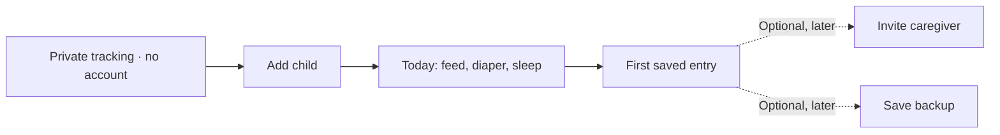

# Babytrack, Nara, and Huckleberry: features and first use

Status: research synthesis and proposed priorities, September 30, 2026.
The Android welcome and first-child form are implemented in the working
build. Priorities 1–3's presentation work (Today, capture, live nursing and
pumping timers, History day view) is being delivered in
[010](../tactical/010-android-design-pass.md); reports and later priorities
remain proposals.
This topic owns the competitor comparison and its prioritization rationale.
Recommendations here are proposals, not changes to the agreed MVP or delivery
order. The [MVP plan](../mvp-plan.md#milestones) owns committed scope;
[Android navigation](android-navigation.md), [interface design](interface-design-and-localization.md),
and the [event model](event-model.md) own the resulting product decisions
when a proposal is accepted. Implementation status remains in
[005](../tactical/005-m1-android.md) and [006](../tactical/006-m2-web.md).

## Product conclusion

Babytrack's strongest opportunity is **private, accountless tracking that
gets out of a tired parent's way**. A parent should be able to add their
child, save a feed or diaper, and understand the result before encountering
sharing, backup setup, permission requests, or advanced preferences.

Most basic logging categories already exist in the Android developer build.
The largest practical gaps are live nursing and pumping timers, richer
history and summaries, reminders, and the polish around those tasks. More
categories will not compensate for a slow or confusing common action.

Nara's observed strength is breadth across baby care and the parent's own
tracking. Huckleberry combines tracking with substantial sleep and parenting
personalization. Babytrack should first become a dependable daily tracker,
then selectively add useful records and summaries. Matching Huckleberry's
advice, prediction, and AI surfaces would be a separate product direction,
not a prerequisite for competitive tracking.

Free core tracking is also a meaningful distinction from Nara's published
paid model. Huckleberry already offers free basic tracking, so our advantage
there must include the simpler start, privacy, portability, and daily UX.

## Evidence and comparison rules

The comparison uses fresh-account Android research on a Pixel 7a, supplemented
by the official pages identified below:

- Nara 2.8.2: 139 captured screens/states, 14 mapped flows, 27 feature records.
- Huckleberry 0.9.307: 226 captured screens/states, 33 flows, 48 feature records.
- Babytrack: repository implementation and recorded validation at
  `104008f`, plus the Android first-use working-tree slice recorded in
  [005](../tactical/005-m1-android.md#child-first-onboarding).
  The web preview remains narrower and has its earlier onboarding.

These are successive states, not counts of distinct screen templates.
Competitor observations are dated evidence, not exhaustive inventories.
“Not tested” means unknown, rather than absent. Signup was required on the
new-user paths we followed; alternate paths were not exhaustively checked.
Both competitors retained a newly saved bottle offline through app
force-stop and relaunch after account setup. **Offline logging alone is not
our differentiator. Starting without an account is.**

Babytrack “working” below means implemented with the evidence recorded in
its owning topic/tactical. It does not mean a public release, full platform
parity, or a completed physical-phone usability gate. This comparison omits
protocol internals and makes no inference about competitor privacy from
signup screens. Advice quality, paid expiry, notification delivery, and
end-to-end competitor sharing were not evaluated.

## What each product is offering the parent

| Product | Observed experience / intended promise | Implication for babytrack |
| --- | --- | --- |
| Nara | A broad baby-and-parent journal: care logs, trends, guides, caregivers, and a direct switch into the parent's own tracking. | Learn from quick context switching and useful history. Parent wellbeing is a distinct expansion opportunity. |
| Huckleberry | Tracking plus sleep-oriented support: age-specific onboarding, reports, SweetSpot, schedule creation, questionnaires, Insights, and Berry. | Learn from timers and reports. Treat guidance/predictions as a separate investment with substantial content and maintenance needs. |
| Babytrack | Accountless local tracking, optional caregiver sharing, readable exports and restorable files; a quieter three-destination interface. | Make immediate usefulness and control visible. Sharing should be discoverable without being a prerequisite. |

Nara showed a seven-day trial notice after the first saved child entry and
again on a first parent entry. Huckleberry showed a dismissible paid offer
before tracking, followed by a newborn Premium gift. We did not exercise
trial expiry on the phone.

**Official-page check, September 30:** Nara's FAQ describes $9.99/month or
$99.99 lifetime per app family. After the seven-day trial, existing data can
be viewed/exported, but new logging requires payment. One payment covers
that family's caregivers. This is published policy, not tested expiry
behavior. [Nara FAQ](https://nara.com/pages/nara-baby-app-faqs)

Huckleberry's published free tier includes basic logging, reports and
multi-device sync; Plus/Premium add advanced tools and guidance. Its FAQ
instructs caregivers to use the same account on multiple phones.
[Huckleberry pricing and FAQ](https://huckleberrycare.com/pricing?scrollTo=true)

Babytrack's planned free core tracking and absence of upsell in capture are
useful positioning. Against Nara, ongoing free logging and migration matter;
against Huckleberry, free basic logging alone does not distinguish us.

## Feature comparison

The primary babytrack column describes Android today. Platform differences
are called out separately below. Evidence keys refer to the register at the
end of this document.

| Parent task | Nara observed | Huckleberry observed | Babytrack Android today | Gap / direction |
| --- | --- | --- | --- | --- |
| Start tracking | Account, baby profile, tracking choices, notification and caregiver steps before dashboard. [N1] | Age choice, four newborn intro pages, signup, child/context steps, notification rationale and paid offer. [H1] | No account. Privacy-focused welcome → name/nickname and optional birthday → Today. | Child-first setup now keeps Family organization behind the first task; continue refining daily actions. |
| Child profile / switching | Profile correction saved; add-child and family controls observed. [N1, N4] | Profile edit saved; Add Child form validated and cancelled. [H4] | Multiple Families/children and header target switching; name, optional birthday, growth-chart sex and derived age. | Keep clear target selection; avoid requiring later-use fields before a first log. |
| Bottle feed | Milk/formula, mL/fl oz, notes, optional formula brand; save/edit tested. [N2] | Type, mL/oz, notes; save/edit tested. [H2] | Content choices, mL/US fl oz/UK fl oz, notes, time and same-entry correction. | Already broad enough. Improve remembered choices and fast entry rather than add brand catalogs first. |
| Nursing | Live left/right counters, side switching, stop/resume and last-side summary. [N2] | Side switching pauses prior side; pause and manual duration correction tested. [H2] | Live left/right timer with switch, pause, last-side mark and force-stop recovery as a local draft; manual minutes remain; correction supported ([010](../tactical/010-android-design-pass.md)). | Gap closed on Android for local use; cross-device live timer sync and a nursing notification remain open. |
| Sleep | Active timer, reopen, stop and force-stop recovery tested. [N2, N5] | Closing editor preserves active timer; force-stop recovery and optional sleep context tested. [H2, H5] | Running and completed sleep, place, correction, Today start/stop with a live elapsed clock, ongoing notification and basic widget. | Physical-phone checks remain. |
| Pumping | Live timer, total/split volume UI; total fixture saved/reopened. [N2] | Manual/timer modes, split volumes, pause and staged save tested. [H2] | Stopwatch that fills the interval, total or left/right mL, and amount correction. | Improve unit entry. Freezer inventory is a separate deferred feature. |
| Diaper | Wet/dirty/mixed, color/texture, blowout and rash. [N2] | Pee/poo/mixed/dry plus sizes, color, consistency and rash. [H2] | Wet/dirty/both/dry, notes, correction and quick wet action. | Core coverage present. Rich attributes are optional breadth, currently outside MVP. |
| Solids | Category and combo-feeding choice observed; deeper path not tested. [N2] | Search/grid, banana selection, reaction, per-food calendar; custom food/photo affordances. [H2, H3] | Foods list and optional amount text; save and correction. | Later add food reuse/search and descriptive reactions/history. Do not turn reactions into allergy diagnosis. |
| Growth | Category/profile affordance observed; charts not researched on phone. Official FAQ documents WHO curves. [N2, N4, W1] | Height/weight/head curves, unit choices and visible percentiles after supplying sex. [H3, H4] | Weight/length/head entry, units and correction; no reference curves yet. | Existing MVP follow-through: chart display after reference-data reuse is resolved. |
| Medication / temperature | Medical/Vaccines categories observed; these editors not tested. [N2] | Custom medicine type/unit/amount and temperature C/F saved. [H2] | Medication name/dose text, C/F temperature, correction and notes. | Basic records exist. Dedicated vaccine history and reusable medicine lists are later candidates; no dosing advice. |
| Milestones / photos | Baby Firsts, Milestones, Notes/Photos destinations observed; saves not tested. [N2, N4] | Built-in/custom milestones, date/notes saved; photo affordances. [H2] | General notes; no dedicated milestone or photo attachment UI. | Genuine feature gap, but lower frequency than daily feeds/sleep. A note is only a workaround. |
| Routines / other activities / potty | Routines category observed; not tested. [N2] | Bath, tummy/story/screen/skin-to-skin activity choices; bath duration saved; potty outcomes inspected. [H2, H4] | No dedicated activity, routine or potty types. | Consider simple activity records after core daily use; potty becomes relevant for older children. |
| Edit / delete / recover a mistake | Populated editors; delete cancel/preserve and confirm/remove tested. [N2] | Details → Edit; same-entry correction and delete confirmation tested. [H2] | Same-entry corrections, time changes, confirmed delete and short Undo. | A useful existing capability; improve discoverability and keep return position stable. |
| History / daily totals | Week grid, day totals/timeline, category filters, editor links. [N3] | Day/week/list/summary, populated totals and category controls. [H3] | Day view with a week strip, the core's totals for any chosen day, one-row filters and icon rows; an All days list; Today tiles show time since the last feed, sleep and diaper. | Multi-day charts remain the next presentation gap (reports need a scope decision). |
| Trends / longer ranges | Feeding/pumping/diaper/sleep metrics; Calendar/Graph/Entries; 1/7/14-day choices. [N3] | Category summaries; sleep 7/14/30/90-day/year and feeding ranges tested. [H3] | No trend charts or multi-day report UI. | Major ongoing-use gap: start with descriptive 7/14-day sleep and feeding reports. |
| Day/night / sleep patterns | Nighttime preferences and day/night metrics observed. [N3, N4] | Child cutoffs, report day boundary, nap/sleep trends; Midnight change and restoration tested. [H3, H4] | Midnight calendar days; no configurable boundary or day/night pattern UI. | Descriptive nap/night summaries first. Configurable boundaries require an explicit later scope decision. |
| Scheduled reminders | Reminder entry blocked with notifications denied; delivery not tested. [N4] | Fixed/after-last-feed modes, weekdays/daytime/sound options, interval validation; no schedule saved. [H4] | Sleep-running notification; no scheduled feed/care reminder UI. | A notification about an active timer does not close the reminder gap. Add opt-in simple reminders. |
| Preferences / customized home | Activity visibility and communication preferences observed. [N4] | Theme, units, time format and Live Updates; metric/theme round trip and Potty visibility round trip tested. [H4] | Light/dark support and per-entry measurement units; fixed quick actions and activity chooser. | Remember preferred units; allow a small set of pinned common actions before a fully configurable dashboard. |
| Parent's own tracking | Direct context switch; hydration, mood/intensity and journal fixtures saved; seven categories. [N4] | Parent preferences personalize guidance; equivalent parent activity logs not found in inspected surfaces. [H6] | No separate parent context or parent-specific records. | Nara's clearest breadth advantage. Evaluate a later parent journal/mood/hydration slice if caregivers want it. |
| Caregiver collaboration | Invitation and family-management forms observed; no invite sent. [N4] | Shared-account wording observed; official FAQ confirms same-account sharing. No end-to-end sharing tested. [H1, H4, W2] | Accountless invitation/link/device flows implemented; multiple caregiver UX still needs phone validation. | Make independent invitation-based access easy, without a shared password. Nara also offers separate caregiver accounts; sync performance remains untested. |
| Export / recovery / moving apps | Branded week-image preview and share chooser observed; official FAQ documents CSV export, not executed. Recovery untested. [N5, W1] | CSV confirmation emails a 24-hour download link; cancelled. Restore not tested. [H4] | Direct analysis CSV and readable/protected restorable files. Competitor import not implemented. | Existing data portability is valuable. Import removes switching friction; samples/mapping remain open. |
| Guides / predictions / AI | Guide list/filter and one illustrated article layout researched. [N3] | SweetSpot settings, age-two-month schedule gate, paid expert-plan entry, Insights Tips/Miniplans and Berry context setup. [H4, H6] | No guide library, predictive schedule or AI assistant. | Large breadth gap, deliberately outside clinical MVP scope; do not make it the next parity project. |
| Web / iOS / watches | Not researched on phone; official FAQ describes iPhone/Siri/Apple Watch features. [W1] | Not researched on phone; official page lists iOS Apple Watch support. [W2] | Web subset exists; iOS and watches are planned. | A real delivery gap for mixed-platform households. Published support does not establish tested platform parity. |

### Platform qualification

The web preview currently supports diaper, bottle, notes, and timed nursing,
including nursing correction and retained drafts through reload. It also has
native-managed caregiver joining and readable file recovery. It does not
have Android's complete capture set. Android, meanwhile, has broader capture
coverage but still lacks that live nursing UI. Neither partial implementation
should be described as full cross-platform parity. See the
[web client](web-client.md) and [event model](event-model.md).

## Proposed priority order

Priorities use frequency, friction removed, usefulness without advice, and
fit with the current product. They are not a feature-count contest or a new
milestone schedule. Validate with actual caregiver use before expanding scope.

| Order | Focus | Why now / useful completion signal |
| --- | --- | --- |
| 1 — first value | Child-first accountless welcome; calm Today; fast bottle/diaper and sleep actions; clear saved feedback. | Let a new parent save a real entry without learning Family terminology. A new offline installation can reach a saved log with one child form and no unrelated setup. |
| 2 — daily reliability | Android live nursing and pumping timers; pause/switch/manual correction; visible timer recovery and a stable return to the prior screen. | Both references make these central tasks convenient. Run a feeding with one hand, leave the app, reopen it and finish without reconstructing durations. |
| 3 — understand the day | Better history detail, consistent units/duration display, time since last event, 7/14-day feeding and sleep summaries, then a week visualization. | Our existing totals are a base, but competitors make repeated patterns easier to inspect. Parents should answer “what happened today?” and “what changed this week?” without manual calculation. |
| 4 — remove repeated effort | Preferred units, pinned common actions, simple opt-in reminders, polished second-caregiver join, competitor import. | Reduce repeated settings/input and the cost of moving to babytrack. Keep reminder denial harmless and imported records previewable. |
| 5 — selected breadth | Food reuse/reactions/history, milestone/photo records, simple activities, then parent tracking or potty based on the audience. | These close genuine feature gaps while retaining a records-first product. Choose a coherent slice rather than launch all categories together. |

**Required MVP work remains required.** Growth percentile display is already
planned; reference-data reuse must be resolved in its
[owning event-model topic](event-model.md). Imports, recovery, caregiver
usability, accessibility, and physical-phone gates remain in
[005](../tactical/005-m1-android.md). The sequence above does not waive those
requirements. Reports, reminders, new activity types, parent tracking, and
configurable day boundaries need explicit scope decisions before implementation.

**Keep later or outside this product direction:** a personalized sleep-plan
service, clinical/developmental advice library, Berry-style AI chat, voice/AI
logging, freezer inventory, and pregnancy tracking. Some are legitimate
competitor strengths; each introduces substantially more than a capture
form. Medical advice and clinical content stay outside the MVP. Voice and
freezer inventory are already deferred in the MVP plan. Pure recordkeeping
such as a vaccine log can be considered separately from advice.

## First-use comparison and babytrack direction

The meaningful comparison is the path to **first useful saved data**, not the
number of onboarding screens. No reliable stopwatch measurement was taken.

| Product | Observed fresh-user path | Where extra work appears |
| --- | --- | --- |
| Nara | Account/relationship → baby profile → activity choices → notification step → caregiver invitation/welcome → dashboard → first save. | Identity/setup precedes tracking; trial notice appears after first save. |
| Huckleberry | Welcome → age branch → four newborn intro pages → signup → child/context/questions → notification/goal → paid offer → free/gift access → Home. | Multiple setup and offer steps; further sleep, Insights and Berry questionnaires are encountered later. |
| Babytrack before this slice | First-run create/join/restore choices → New Family → Add child form → Today → first save. | Accountless, but internal organization preceded the parent's actual task. |
| Babytrack Android working build | Welcome → one child form → Today → first save. | Only a name/nickname is required; birthday is optional, join/restore stay direct, and other profile details are deferred. |

### 1. Welcome: explain the benefit in one glance

Implemented Android headline:

> Private baby tracking. No account required.

The implemented welcome omits supporting paragraphs, marketing subtitles,
and benefit cards. Field labels and actions carry the flow.

Primary action: **Add your child**. Secondary actions: **Join a Family**
and **Restore backup**. An incoming invitation should lead to joining,
not create an unwanted empty child profile first. Keep a quiet **Privacy** link for people who want detail. No introductory carousel, login,
subscription choice, notification request, or tracking-preference checklist
is needed to save a first local record.

The accountless claim describes current capability. There is no optional
account-creation UI today; a future account must not become a prerequisite
for local tracking or sharing. The capability already exists, so the next
improvement is how simply we present it.

### 2. One child form, with a reachable finish action

Ask for a **name or nickname**. Keep birth date labeled optional. Avoid helper
copy that repeats field labels. Keep growth-chart sex in optional profile
details or
ask when charts are first opened; explain why that feature needs it without
blocking ordinary tracking. Avoid asking whether this is the first baby,
feeding goals, bedtime habits, caregiver email, or a Family name here.

The existing local Family can be created behind this action. **Start
tracking** completes setup and goes to Today. Preserve input on failure and
make retries return to the same usable setup, rather than leave a new parent
navigating an empty Family. This welcome/form slice is now implemented;
[Android navigation](android-navigation.md) owns the current contract.
The broader Today and later contextual prompts below remain proposals.

For twins or another child, provide an unobtrusive **Add another child**
after the first profile is usable. Keep the selected child obvious before
every log. Do not demand a multi-child configuration up front.

### 3. Today should teach through the real task

Show the child name and optional age, three obvious common actions, and a
simple empty state: **No entries yet. Add a feed, diaper, or sleep.** Keep
less-common categories in Add activity. A new parent's first view should not
be a wall of zero statistics or administrative status.

After Save, return to the caller, show the actual new entry and a brief
**Saved on this device** confirmation. Update the last-event display and
daily totals. A timer should clearly change from “start” to an active state
with a visible stop/pause action. Saved feedback should describe the
completed action, not imply that another caregiver has already received it.

### 4. Ask for permissions at the useful moment

Request notification permission when a parent starts a timer or deliberately
enables a reminder, with a short explanation of that benefit. Android already
requests it after sleep starts; retain that timing. Declining must leave the
timer and logging usable. Do not ask for photo access before a photo is being
attached or lead first run with multiple system dialogs.

### 5. Introduce sharing and backup after value

After the first useful entry, offer a quiet optional caregiver-sharing action
and an accessible backup action. Neither should interrupt the next log.
Sharing should explain what the caregiver will see, especially that existing
history is included. Backup should explain what has actually been saved and
where the parent can find the file. Keep both reachable from Family/settings;
prioritize backup setup once there is meaningful history worth keeping.

Do not imply that a login would recover unsaved records. Accountless use
needs an understandable recovery path, not an onboarding lecture about its
implementation. See the [Family contract](family-sharing-and-trust.md) for
the existing promises.

## How to talk about privacy

Yes: make privacy a visible product advantage. Lead with concrete benefits:

- **No email or account needed to start.**
- **Your local records stay on this device until you choose to share or export.**
- **You choose which caregivers get access.**
- For a sharing explanation: **Our service cannot read your shared tracking records.**

These statements connect to the existing
[Family sharing contract](family-sharing-and-trust.md), without requiring a
parent to learn protocol terms. The local-storage statement applies to
unshared tracking, not to a Family the parent has already chosen to share.
Readable exports and chosen caregivers can have readable copies. Device
access and network metadata also make “totally private” broader than the
promise we need. Use **Private by default** or **Private tracking, no account
required**, followed by a short plain-language explanation.

Do not say competitors are unprivate because they ask for accounts; this
research did not audit their data practices. Our strongest comparison is
observable: **we can deliver the first saved log without giving an email,
choosing a password, or navigating a subscription offer.** The Android
child-first flow now presents that advantage directly.

## Validation and open decisions

The Android welcome and first-child form are the accepted first slice;
[005](../tactical/005-m1-android.md#child-first-onboarding) records its validation.
Choose subsequent slices in the owning topics/tactical. First-use acceptance
uses synthetic fixtures and disposable installations, then the actual phone:

1. First launch offline → nickname → first saved bottle/diaper; no account,
   network, permission or offer prerequisite.
2. Back/restart during setup → recover input or show a clear retry; avoid
   duplicate/stranded child setup.
3. Start a timer → decline notifications → navigate away/reopen → finish and
   correct the entry without lost work.
4. Switch child → never carry an unsaved log into the wrong child's history.
5. Invitation-first and file-restore entry paths remain direct and usable.
6. Check one-handed reach, keyboard/insets, dark night use, large text and
   screen-reader labels. Existing emulator evidence does not close these
   physical-phone gates.

Measure time and interactions to first save, whether the parent can identify
where data is stored, ease of finding the last feed, and whether they can
correct a mistake. Do not compare onboarding speed using capture counts.

Open choices: which three quick actions deserve prominence; whether date
stays on the main child form; the first report metrics; reminder scope; which
export samples unlock migration; and whether later audience expansion should
favor solids/milestones, parent tracking, or older-child routines. Revisit
priorities after a week of real caregiver use, if missed competitor features
block switching, or if the simple first-use path still causes confusion.

## Evidence register

Raw screenshots, UI snapshots and research JSON stay in gitignored
`local-references/`. The links below work in the research workspace; a clean
checkout will not contain those private/local artifacts. This synthesis
contains no research-account credentials or personal child records.

| Key | Evidence group | Representative local capture / further IDs |
| --- | --- | --- |
| N1 | Enrollment and child setup | [Baby setup](../../local-references/nara/index.html#after-account); `create-account`, `account-relationship`, `after-baby`, `onboarding-next`, `onboarding-invite`, `bottle-saved`. |
| N2 | Daily baby categories and correction | [Bottle correction](../../local-references/nara/index.html#bottle-correction-saved); `baby-activities-lower`, `breastfeed-right-running`, `pump-saved-reopened`, `diaper-empty`, `diaper-deleted`, `history-sleep-editor`. |
| N3 | History, trends and guides | [History day view](../../local-references/nara/index.html#history-day-all); `history-populated`, `trends-lower-1`, `trends-lower-2`, `trends-lower-3`, `trends-feed-week`, `guide-article`. |
| N4 | Parent tracking, profiles and settings | [Parent day history](../../local-references/nara/index.html#parent-history-day); `tracking-context-menu`, `parent-edit-activities`, `hydration-filled`, `mood-filled`, `journal-saved`, `family-settings`, `parent-reminders`. |
| N5 | Offline/restart and image sharing | [Offline reopened bottle](../../local-references/nara/index.html#offline-bottle-reopened); `restart-sleep-reopened`, `restart-sleep-complete`, `history-share-panel`, `subscription-trial`. |
| H1 | Newborn enrollment | [Age choice](../../local-references/huckleberry/index.html#002-create-account); `003-newborn-value` through `007-registration`, `011-child-name`, `018-notification-permission`, `020-goal-result`, `021-free-path`. |
| H2 | Daily logging and correction | [Nursing side switch](../../local-references/huckleberry/index.html#057-nursing-right-running); capture groups 030–136 for bottle, diaper, nursing, sleep, pumping, solids, milestones, medicine, growth, temperature and bath. |
| H3 | Reports and growth | [Populated day report](../../local-references/huckleberry/index.html#144-reports-day); `150-reports-boundary-restored`, 151–161 trends/food history, 209–213 growth list/curves. |
| H4 | Profile, settings, reminders and membership | [Questionnaire retained answer](../../local-references/huckleberry/index.html#192-questionnaire-retained-second); 162–204 preferences, child/CSV, SweetSpot, schedule gate, questionnaires, reminders, customization, prices, account and Add Child. |
| H5 | Offline and timer restart | [Offline bottle detail](../../local-references/huckleberry/index.html#141-offline-reopened); `066-sleep-close-x`, `069-sleep-restart-check`, `070-sleep-reopened-restart`, `137-offline-bottle-new`, `140-offline-relaunch`. |
| H6 | Berry and Insights | [Insights dashboard](../../local-references/huckleberry/index.html#221-insights-dashboard); 205–208 Berry, 214–224 parent preferences, Tips and Miniplans. |

Official supplementary sources (checked September 30, 2026):

- **W1:** [Nara FAQ](https://nara.com/pages/nara-baby-app-faqs), for paid access,
  documented CSV/growth/platform features, and separate caregiver accounts.
  These statements supplement untested branches; they are not phone results.
- **W2:** [Huckleberry pricing and FAQ](https://huckleberrycare.com/pricing?scrollTo=true),
  for the free tier, advanced tiers, same-account caregiver sharing and
  published Apple Watch support. In-app offers may vary from web offers.

Babytrack sources: [event model](event-model.md),
[Android navigation](android-navigation.md),
[interface design](interface-design-and-localization.md),
[Family product promises](family-sharing-and-trust.md),
[Android delivery evidence](../tactical/005-m1-android.md),
[web delivery evidence](../tactical/006-m2-web.md), and
[MVP scope](../mvp-plan.md#milestones). Current UI was cross-checked in
`TodayScreen.kt`, `FamilyScreen.kt`, `ChildProfileScreen.kt`, `CaptureScreen.kt`,
`TrackerRoute.kt`, `SleepTimerNotifications.kt`, and the Android/web copy catalogs.
